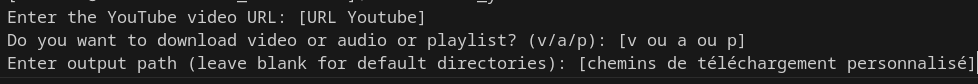

# YouTube Media Downloader

YouTube Media Downloader est un projet Python permettant de télécharger des vidéos, des audios, et des listes de lecture depuis YouTube. Le projet comprend des fonctionnalités pour assembler et convertir des médias, et propose une interface utilisateur simple pour la gestion des téléchargements.

## Table des matières

- [Introduction](#introduction)
- [Prérequis](#prérequis)
- [Installation](#installation)
- [Utilisation](#utilisation)
- [Fonctionnalités](#fonctionnalités)
- [Exemple](#exemple)
- [Structure du Projet](#structure-du-projet)
- [Contributeurs](#contributeurs)

## Introduction

YouTube Media Downloader permet aux utilisateurs de télécharger et de convertir des contenus multimédias de YouTube en fichiers audio et vidéo. Le projet est conçu pour être facile à utiliser et fournit des options pour télécharger des vidéos individuelles, des fichiers audio, et des listes de lecture complètes.

## Prérequis

Python 3.7 ou version ultérieure
Modules Python : pytube, tqdm

## Installation

1. Clonez le dépôt Git :

```bash
git clone git@github.com:florian-labadie/Youtube_Downloader.git
```

2. Accédez au répertoire du projet :

``` bash
cd Youtube_Downloader
```

3. Installez les dépendances nécessaires :

``` bash
pip install -r requirements.txt
```

## Utilisation

### Télécharger une Vidéo

Pour télécharger une vidéo depuis YouTube, utilisez la commande suivante :

``` bash
make run
```

Suivez les instructions pour entrer l'URL de la vidéo et spécifier les options.

### Télécharger un Fichier Audio

Pour télécharger l'audio d'une vidéo YouTube, utilisez la même commande et sélectionnez l'option audio.

### Télécharger une Liste de Lecture

Pour télécharger une liste de lecture complète, utilisez la même commande et sélectionnez l'option playlist

### Options

- a : Télécharger uniquement l'audio.
- v : Télécharger uniquement la vidéo.
- p : Télécharger toute la liste de lecture.

## Fonctionnalités

* Téléchargement Vidéo : Télécharge des vidéos depuis YouTube dans la meilleure résolution disponible.

* Téléchargement Audio : Télécharge l'audio d'une vidéo YouTube et le convertit en MP3.

* Téléchargement de Liste de Lecture : Télécharge tous les vidéos d'une liste de lecture YouTube en format Audio MP3.

* Chemins de Téléchargement Par Défault :

    * Audio et Listes de Lecture : Les fichiers audio sont stockés dans le répertoire Music.
    * Vidéos : Les vidéos sont stockées dans le répertoire Video.

Vous pouvez également spécifier des chemins de répertoires personnalisés lors de l'exécution des scripts si vous préférez utiliser des emplacements différents pour les téléchargements.

## Exemple



## Structure du Projet

Le projet est organisé comme suit :

``` bash
Youtube_Downloader/
├── .github/workflows/             # Fichier github actions
│   └── integration.yml               # CI/CD
├── assets/             # Fichiers image
│   └── image.png               # Pour README
├── src/                # Code source principal
│   ├── check_youtube_url.py    # Vérification des URLs YouTube
│   ├── download_and_convert.py # Fonctionnalités de téléchargement et conversion
│   ├── get_standard_path.py    # Gestion des chemins de répertoires
│   ├── validate_output_path.py # Validation du chemins de répertoires données
│   └── youtube_downloader.py   # Script principal pour l'interaction utilisateur
├── .gitignore  
├── Makefile            # Executable
├── requirements.txt    # Dépendances Python
├── main.py             # Point d'entrée du script principal
└── README.md           # Documentation du projet
```

## Contributeurs

- Labadie Florian ([GitHub](https://github.com/florian-labadie))
